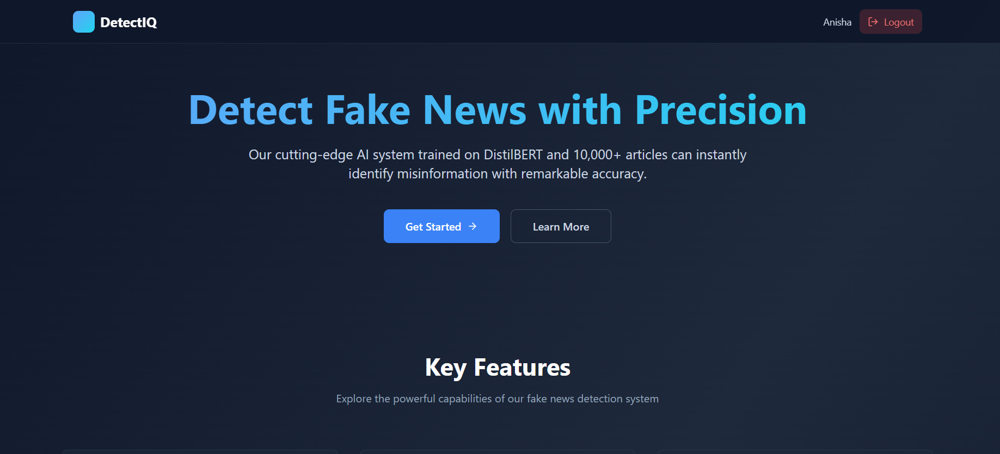
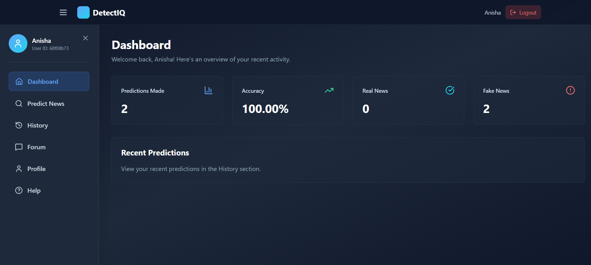
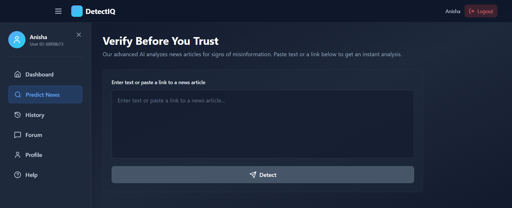

# 🛡️ Fake News Detection System

An AI-powered full-stack web application that detects fake news using DistilBERT and the MERN stack.

## 🚀 Features

- 🤖 **AI-Powered Detection** - DistilBERT model trained on 10,000+ articles
- 🔐 **User Authentication** - Secure JWT-based auth system
- 📊 **Dashboard Analytics** - Track prediction history and statistics
- 💬 **Community Forum** - Discuss findings with other users
- 📱 **Responsive Design** - Works seamlessly on all devices

## 🛠️ Tech Stack

**Frontend:** React, Tailwind CSS, Axios, React Router  
**Backend:** Node.js, Express.js, MongoDB, JWT  
**AI Model:** Python, Flask, DistilBERT (Transformers)

## 📸 Screenshots

Click to view screenshots

### Landing Page

### Dashboard

### Prediction Interface

## 📝 License

This project is licensed under the MIT License - see the [LICENSE](LICENSE) file for details.

## 👤 Author

**Your Name**
- GitHub: [@anisha2702](https://github.com/anisha2702)
- LinkedIn: [Anisha](https://linkedin.com/in/anishakumari27)

## 🙏 Acknowledgments

- Dataset: [Kaggle Fake News Dataset](https://www.kaggle.com/datasets/clmentbisaillon/fake-and-real-news-dataset)
- Model: [DistilBERT by Hugging Face](https://huggingface.co/distilbert-base-uncased)
- Icons: [Lucide React](https://lucide.dev/)

## 📧 Contact

For questions or support, please open an issue or contact at your.email@example.com

---

⭐ **Star this repo if you find it helpful!** ⭐